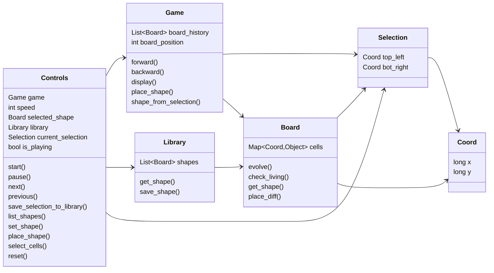
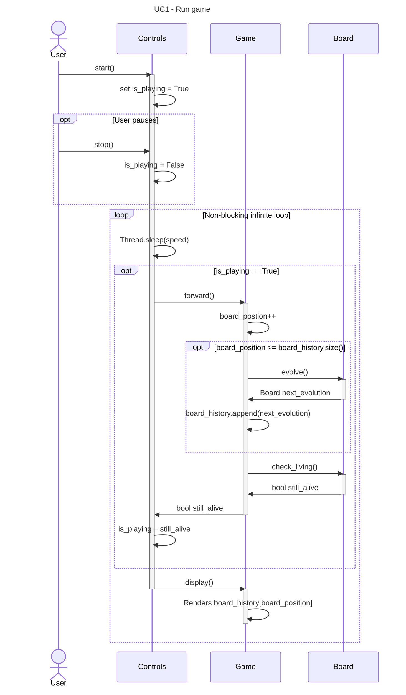
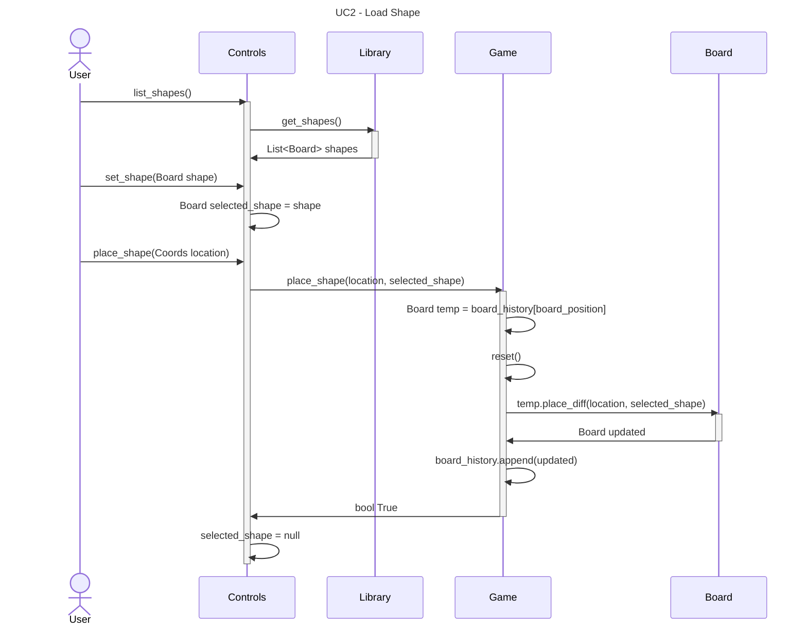
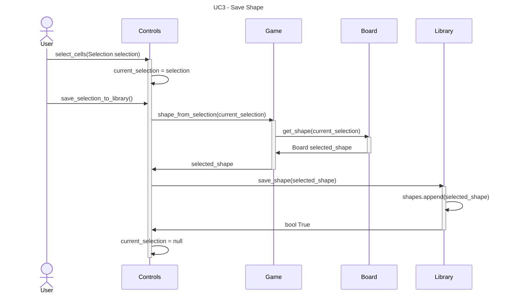

## Controls
### Attributes
- Game game
	- Instance of the game
- int speed
	- Time between frames in milliseconds
- Board selected_shape
	- Currently selected shape
- Library library
	- Shape library for saving and loading shapes
- Selection current_selection
	- Currently selected coordinates
- bool is_playing
	- If the game is playing or not
### Methods
- start()
	- sets is_playing to true
- pause()
	- sets is_playing to false
- next()
	- Moves the game one generation forward
- previous()
	- Moves the game on generation backwards
- save_selection_to_library()
	- Saves whatever is in the current selection on the current game board as a shape to the shape library
- list_shapes()
	- Gets all of the shapes from the shape library to display and select from
- set_shape(Board shape)
	- Sets the active shape from the shape library (or a selection)
- place_shape(Coord location)
	- Places the selected_shape onto the game board
	- If no shape, treat as toggling a single cell at the given coordinates
- select_cells(Coord top_left, Coord bottom_right)
	- Sets the current_selection coordinates
- reset()
	- Resets the game to initial state

## Game
### Attributes
- List\<Board\> board_history 
-  int board_position
### Methods
 - forward() -> bool
	 - increments board_position by 1, and ensures there is a generated board in that position
	 - returns True if new board has living cells, False otherwise
 - backward()
	 - decrements board_position by 1, and ensures there is a generated board in that position
	 - If already on 0 this does nothing.
 - display()
	 - displays the current board in the UI
 - place_shape(Coord location, Board shape)
	 - saves board to temp var
	 - triggers a reset
	 - Adds temp board as 0 in board_history
	 - Adds the given shape to the current board
		 - If no shape is given do the above but toggle the cell at the given coordinates
 - shape_from_selection(Selection selection) -> Board shape
	 - Creates and returns a new shape that is a sub set of the current board within the given selection area.

## Board
### Attributes
 - Map\<Coord,Object> living_cells
### Methods
 - evolve() -> Board
	 - Generate the next evolution of this board based on the game rules and return it
 - check_living() -> bool
	 - True if there are living cells on the board, false otherwise
 - get_shape(Selection selection) -> Board
	 - Return a new board that is the intersection of the selection and the board
 - place_diff(Coord location, Board shape)
	 - If shape is not null, union of shape and Board with shape centered at the given location
		 - does not kill living cells only adds more living cells
	 - If shape is null, toggle the status of the cell at location
		 - can kill a living cell

## Library
### Attributes
- List\<Board\> shapes
### Methods
- get_shapes()
- save_shape(Board shape)

## Selection
### Attributes
 - Coord top_left
 - Coord bottom_right
### Methods
- getters and setters

## Coord
### Attributes
- long x
- long y
### Methods
- getters and setters

